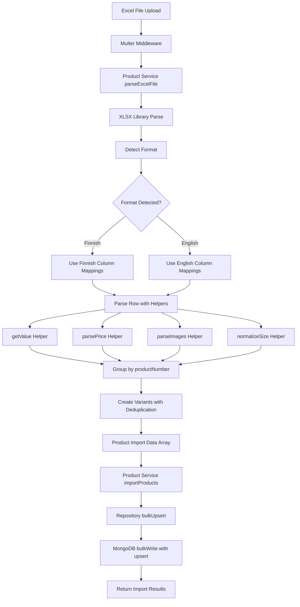
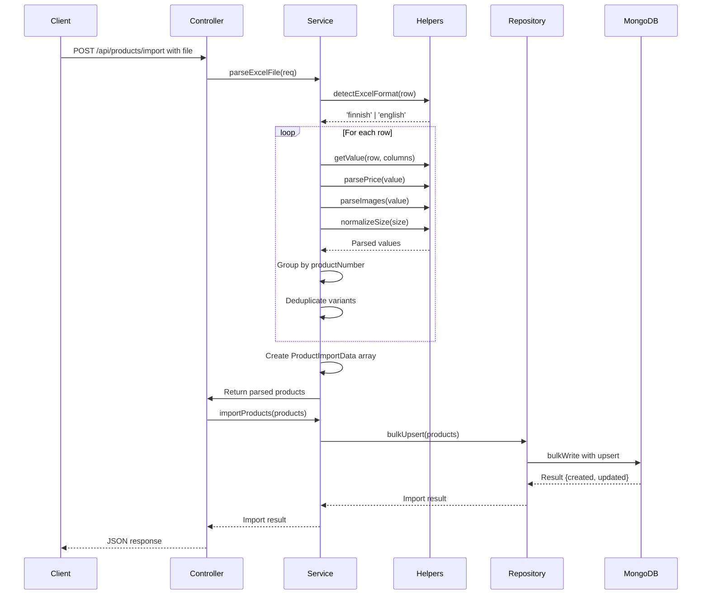

# Dual-Format Excel Importer Implementation Plan

## Overview

This plan outlines the implementation of a robust Excel importer that automatically handles two supplier Excel formats (Finnish and English) without manual configuration. The importer will parse Excel files, convert rows into product documents with variants, and perform bulk upsert operations to MongoDB.

## Current State Analysis

### Existing Implementation

- **Product Model**: [`backend/src/models/product.model.ts`](../backend/src/models/product.model.ts) - Already supports all required fields including variants
- **Product Service**: [`backend/src/services/product.service.ts`](../backend/src/services/product.service.ts) - Currently only supports Format A (Finnish columns)
- **Product Repository**: [`backend/src/repositories/product.repository.ts`](../backend/src/repositories/product.repository.ts) - Has `bulkUpsert` method for upsert operations
- **Product Types**: [`backend/src/types/product.types.ts`](../backend/src/types/product.types.ts) - Defines `ProductImportData` and `ProductVariant` interfaces
- **Dependencies**: `xlsx` library is already installed

### Limitations of Current Implementation

1. Only supports Format A (Finnish columns)
2. No automatic format detection
3. No helper utilities for flexible column mapping
4. No price parsing with € symbol support
5. No size normalization ("no size" → "One Size")
6. No handling of optional "Country of origin" column
7. Not optimized for large files (10k+ rows)

## Requirements Summary

### Format A (Finnish Columns)

| Column Name         | Field Mapping              |
| ------------------- | -------------------------- |
| Product number      | `productNumber`            |
| Brand               | `brand`                    |
| Product name (fi)   | `name`                     |
| Category (fi)       | `category`                 |
| Description (fi)    | `description`              |
| Fabrics (fi)        | `fabrics`                  |
| Gender (fi)         | `gender`                   |
| Jälleenmyyjän hinta | `purchasePrice`            |
| Ohjevähittäishinta  | `salesPrice`               |
| Color (fi)          | `variant.color`            |
| All images          | `images` (comma-separated) |
| Color code          | `variant.colorCode`        |
| Size name           | `variant.size`             |

### Format B (English Columns)

| Column Name            | Field Mapping                           |
| ---------------------- | --------------------------------------- |
| Product number         | `productNumber`                         |
| Brand                  | `brand`                                 |
| Product name (en)      | `name`                                  |
| Category (en)          | `category`                              |
| Description (en)       | `description`                           |
| Fabrics (en)           | `fabrics`                               |
| Gender (en)            | `gender`                                |
| Wholesale price        | `purchasePrice`                         |
| Suggested retail price | `salesPrice`                            |
| Color (en)             | `variant.color`                         |
| All images             | `images` (comma-separated)              |
| Color code             | `variant.colorCode`                     |
| Size name              | `variant.size`                          |
| Country of origin      | `countryOfOrigin` (optional, new field) |

### Shared Columns (Both Formats)

- Product number
- Brand
- All images
- Color code
- Size name

## Implementation Plan

### Phase 1: Create Helper Utilities

#### File: `backend/src/utils/excelHelpers.ts`

Create a utility module with the following helper functions:

1. **`getValue(row: Record<string, unknown>, columnNames: string[]): string | undefined`**
   - Returns the first existing column value from an array of column names
   - Handles both Finnish and English column names
   - Returns `undefined` if none of the columns exist

2. **`parsePrice(value: unknown): number`**
   - Parses price values that may contain € symbol
   - Handles formats: "12.90", "€12.90", "12,90€", "12.90 €"
   - Returns 0 if parsing fails

3. **`parseImages(value: unknown): string[]`**
   - Parses comma-separated image URLs
   - Trims whitespace from each URL
   - Filters out empty strings
   - Returns empty array if parsing fails

4. **`normalizeSize(size: string): string`**
   - Normalizes size values
   - Converts "no size", "No size", "NO SIZE" → "One Size"
   - Trims whitespace
   - Returns original value if no normalization needed

5. **`detectExcelFormat(row: Record<string, unknown>): 'finnish' | 'english' | 'unknown'`**
   - Automatically detects the Excel format based on column names
   - Checks for Finnish-specific columns (e.g., "Jälleenmyyjän hinta")
   - Checks for English-specific columns (e.g., "Wholesale price")
   - Returns 'unknown' if format cannot be determined

6. **`createVariantKey(size: string, color: string | undefined): string`**
   - Creates a unique key for variant deduplication
   - Combines size and color into a string key
   - Used to prevent duplicate variants

### Phase 2: Update Type Definitions

#### File: `backend/src/types/product.types.ts`

Update the `ProductImportData` interface to include the new optional field:

```typescript
export interface ProductImportData {
  productNumber: string;
  name: string;
  description: string;
  category: string;
  brand: string;
  gender: string;
  fabrics: string;
  purchasePrice: number;
  salesPrice: number;
  images: string[];
  color?: string;
  colorCode?: string;
  sizeName?: string;
  variantPrice?: number;
  variants?: ProductVariant[];
  countryOfOrigin?: string; // NEW: Optional field
}
```

### Phase 3: Update Product Model

#### File: `backend/src/models/product.model.ts`

Add the optional `countryOfOrigin` field to the Product schema:

```typescript
export interface IProductDocument extends Document {
  productNumber: string;
  name: string;
  brand: string;
  category: string;
  gender: string;
  description: string;
  fabrics: string;
  images: string[];
  purchasePrice: number;
  salesPrice: number;
  margin: number;
  status: "active" | "inactive";
  variants: ProductVariant[];
  countryOfOrigin?: string; // NEW: Optional field
}

// In ProductSchema:
countryOfOrigin: {
  type: String,
  trim: true,
},
```

### Phase 4: Refactor Product Service

#### File: `backend/src/services/product.service.ts`

Completely refactor the `parseExcelFile` method to:

1. **Import helper utilities**
   - Import all helper functions from `excelHelpers.ts`

2. **Detect Excel format**
   - Use `detectExcelFormat()` on the first row
   - Store the detected format for subsequent rows

3. **Define column mappings for both formats**
   - Create column mapping objects for Finnish and English formats
   - Use `getValue()` helper to retrieve values from either format

4. **Parse each row using helper functions**
   - Use `parsePrice()` for purchase and sales prices
   - Use `parseImages()` for image URLs
   - Use `normalizeSize()` for size values

5. **Group rows by productNumber**
   - Use a Map to group rows by productNumber
   - For each product, collect all unique variants
   - Use `createVariantKey()` to prevent duplicate variants

6. **Handle optional Country of origin**
   - Check if column exists in the row
   - Store value if present, ignore if missing

7. **Optimize for large files**
   - Process rows in batches if needed
   - Use streaming approach for very large files
   - Implement memory-efficient data structures

### Phase 5: Optimize Repository for Bulk Operations

#### File: `backend/src/repositories/product.repository.ts`

Update the `bulkUpsert` method to use MongoDB's `bulkWrite` with `upsert: true`:

```typescript
async bulkUpsert(
  products: Omit<Product, "id">[],
): Promise<{ created: number; updated: number }> {
  if (products.length === 0) {
    return { created: 0, updated: 0 };
  }

  const bulkOps = products.map((product) => ({
    updateOne: {
      filter: { productNumber: product.productNumber },
      update: { $set: product },
      upsert: true,
    },
  }));

  const result = await ProductModel.bulkWrite(bulkOps, { ordered: false });

  return {
    created: result.upsertedCount,
    updated: result.modifiedCount,
  };
}
```

### Phase 6: Update Documentation

#### File: `backend/docs/PRODUCT_IMPORT_API.md`

Update the documentation to reflect:

1. Support for both Finnish and English formats
2. Automatic format detection
3. New optional "Country of origin" field
4. Size normalization rules
5. Price parsing with € symbol support
6. Variant deduplication behavior

## Architecture Diagram



## Data Flow



## Implementation Details

### Helper Function Specifications

#### 1. getValue()

```typescript
function getValue(
  row: Record<string, unknown>,
  columnNames: string[],
): string | undefined {
  for (const col of columnNames) {
    const value = row[col];
    if (value !== undefined && value !== null && value !== "") {
      return String(value).trim();
    }
  }
  return undefined;
}
```

#### 2. parsePrice()

```typescript
function parsePrice(value: unknown): number {
  if (value === undefined || value === null || value === "") {
    return 0;
  }

  let priceStr = String(value);
  // Remove € symbol and whitespace
  priceStr = priceStr.replace(/[€\s]/g, "");
  // Replace comma with dot for decimal separator
  priceStr = priceStr.replace(",", ".");

  const parsed = parseFloat(priceStr);
  return isNaN(parsed) ? 0 : parsed;
}
```

#### 3. parseImages()

```typescript
function parseImages(value: unknown): string[] {
  if (value === undefined || value === null || value === "") {
    return [];
  }

  const imagesStr = String(value);
  return imagesStr
    .split(",")
    .map(url => url.trim())
    .filter(url => url.length > 0);
}
```

#### 4. normalizeSize()

```typescript
function normalizeSize(size: string): string {
  const normalized = size.trim().toLowerCase();
  if (normalized === "no size" || normalized === "nosize") {
    return "One Size";
  }
  return size.trim();
}
```

#### 5. detectExcelFormat()

```typescript
function detectExcelFormat(
  row: Record<string, unknown>,
): "finnish" | "english" | "unknown" {
  const columns = Object.keys(row).map(col => col.toLowerCase());

  const finnishIndicators = [
    "jälleenmyyjän hinta",
    "ohjevähittäishinta",
    "product name (fi)",
    "category (fi)",
    "description (fi)",
    "fabrics (fi)",
    "gender (fi)",
    "color (fi)",
  ];

  const englishIndicators = [
    "wholesale price",
    "suggested retail price",
    "product name (en)",
    "category (en)",
    "description (en)",
    "fabrics (en)",
    "gender (en)",
    "color (en)",
    "country of origin",
  ];

  const finnishCount = finnishIndicators.filter(indicator =>
    columns.some(col => col.includes(indicator)),
  ).length;

  const englishCount = englishIndicators.filter(indicator =>
    columns.some(col => col.includes(indicator)),
  ).length;

  if (finnishCount > englishCount) return "finnish";
  if (englishCount > finnishCount) return "english";
  return "unknown";
}
```

#### 6. createVariantKey()

```typescript
function createVariantKey(size: string, color: string | undefined): string {
  return `${size.toLowerCase()}:${color?.toLowerCase() || ""}`;
}
```

### Column Mapping Configuration

```typescript
const FINNISH_COLUMNS = {
  productNumber: ["Product number"],
  brand: ["Brand"],
  name: ["Product name (fi)"],
  category: ["Category (fi)"],
  description: ["Description (fi)"],
  fabrics: ["Fabrics (fi)"],
  gender: ["Gender (fi)"],
  purchasePrice: ["Jälleenmyyjän hinta"],
  salesPrice: ["Ohjevähittäishinta"],
  color: ["Color (fi)"],
  images: ["All images"],
  colorCode: ["Color code"],
  size: ["Size name"],
  countryOfOrigin: [], // Not available in Finnish format
};

const ENGLISH_COLUMNS = {
  productNumber: ["Product number"],
  brand: ["Brand"],
  name: ["Product name (en)"],
  category: ["Category (en)"],
  description: ["Description (en)"],
  fabrics: ["Fabrics (en)"],
  gender: ["Gender (en)"],
  purchasePrice: ["Wholesale price"],
  salesPrice: ["Suggested retail price"],
  color: ["Color (en)"],
  images: ["All images"],
  colorCode: ["Color code"],
  size: ["Size name"],
  countryOfOrigin: ["Country of origin"],
};
```

### Memory Optimization Strategies

1. **Batch Processing**: Process rows in batches of 1000 to avoid memory overload
2. **Streaming**: Use XLSX streaming API for very large files
3. **Efficient Data Structures**: Use Map for O(1) lookups during grouping
4. **Early Validation**: Validate and filter rows early to reduce memory usage
5. **Lazy Evaluation**: Only process columns that are actually needed

### Error Handling

1. **Format Detection Failure**: Log warning and attempt to parse with both formats
2. **Missing Required Columns**: Throw clear error with list of missing columns
3. **Invalid Price Values**: Log warning and use default value (0)
4. **Duplicate Variants**: Silently skip duplicates (log warning if needed)
5. **Database Errors**: Wrap in try-catch and provide meaningful error messages

## Testing Strategy

### Unit Tests

1. Test each helper function with various inputs
2. Test format detection with different Excel samples
3. Test price parsing with various formats
4. Test size normalization
5. Test image parsing

### Integration Tests

1. Test full import flow with Format A (Finnish)
2. Test full import flow with Format B (English)
3. Test upsert behavior (create new, update existing)
4. Test variant deduplication
5. Test large file handling (10k+ rows)

### Edge Cases

1. Empty Excel file
2. Missing optional columns
3. Invalid price formats
4. Duplicate product numbers
5. Malformed image URLs
6. Very long text fields
7. Special characters in text

## Migration Path

1. **Create helper utilities module** (non-breaking)
2. **Update type definitions** (non-breaking, adds optional field)
3. **Update product model** (non-breaking, adds optional field)
4. **Refactor product service** (breaking, but backward compatible)
5. **Update repository** (performance improvement, non-breaking)
6. **Update documentation** (non-breaking)
7. **Test thoroughly** (critical)

## Rollback Plan

If issues arise:

1. Keep old implementation as `parseExcelFileLegacy`
2. Add feature flag to switch between implementations
3. Monitor error rates and performance metrics
4. Roll back to legacy implementation if needed

## Success Criteria

1. ✅ Automatically detects and parses both Finnish and English formats
2. ✅ Handles price values with € symbol correctly
3. ✅ Parses comma-separated image URLs into array
4. ✅ Normalizes "no size" to "One Size"
5. ✅ Prevents duplicate variants for same product
6. ✅ Handles optional "Country of origin" field
7. ✅ Uses bulkWrite with upsert for efficient database operations
8. ✅ Handles large files (10k+ rows) efficiently
9. ✅ Provides clear error messages for validation failures
10. ✅ Maintains backward compatibility with existing API

## Estimated Implementation Steps

1. Create `backend/src/utils/excelHelpers.ts` with all helper functions
2. Update `backend/src/types/product.types.ts` to add `countryOfOrigin` field
3. Update `backend/src/models/product.model.ts` to add `countryOfOrigin` field
4. Refactor `parseExcelFile` method in `backend/src/services/product.service.ts`
5. Update `bulkUpsert` method in `backend/src/repositories/product.repository.ts`
6. Update `backend/docs/PRODUCT_IMPORT_API.md` documentation
7. Test with both Format A and Format B Excel files
8. Performance test with large files (10k+ rows)

## Notes

- The `xlsx` library is already installed and in use
- The existing `bulkUpsert` method can be optimized to use MongoDB's native `bulkWrite`
- All changes are backward compatible (adding optional fields, not removing)
- The implementation should be memory-efficient to handle large files
- Error messages should be clear and actionable for users
