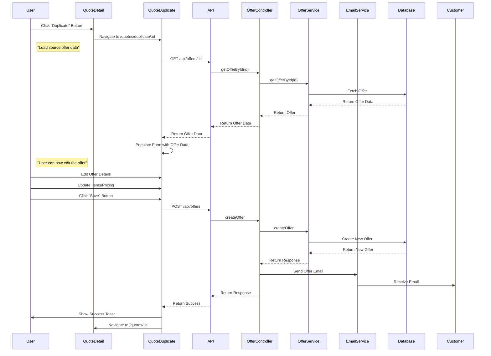

# Offer Duplication Page Implementation Plan

## Overview

This document outlines the plan for creating a dedicated offer duplication page at `/quotes/duplicate/:id` that allows users to duplicate an offer, edit the values, and save/send the offer email to customer.

## User Story

As a salesperson, I want to duplicate an existing offer and be able to edit it before sending to a customer, so that I can quickly create similar offers without starting from scratch.

## Requirements

1. Create a dedicated page at `/quotes/duplicate/:id`
2. When "duplicate offer" action is triggered, redirect to this page with the source offer ID
3. The page should load and display the source offer values
4. User should be able to update/edit all offer values
5. User can save the duplicated offer
6. User can send the offer email to customer after saving

## Current System Analysis

### Existing Backend API

The backend already has the following relevant endpoints:

| Endpoint                    | Method | Purpose                             |
| --------------------------- | ------ | ----------------------------------- |
| `/api/offers/:id`           | GET    | Get offer by ID                     |
| `/api/offers/:id/duplicate` | POST   | Duplicate offer (creates new offer) |
| `/api/offers`               | POST   | Create new offer                    |
| `/api/offers/:id`           | PUT    | Update offer                        |

### Existing Frontend Pages

| Page              | Route         | Purpose                         |
| ----------------- | ------------- | ------------------------------- |
| `QuoteDetail.tsx` | `/quotes/:id` | View and edit offer details     |
| `NewQuote.tsx`    | `/quotes/new` | Create new offer from scratch   |
| `OfferView.tsx`   | `/offers/:id` | Public offer view for customers |

### Current Duplicate Behavior

In `QuoteDetail.tsx`:

- "Duplicate" button calls `apiService.duplicateOffer(quote.id)`
- Backend creates new offer with new offer number
- Frontend navigates to `/quotes/{newOfferId}`
- User can view but must click "Save Changes" to edit

## Proposed Flow



## Implementation Plan

### Phase 1: Backend Enhancements

#### 1.1 Verify Existing API Endpoints

**Status:** ✅ Already exists

The following endpoints are already available:

- `GET /api/offers/:id` - Fetch offer by ID
- `POST /api/offers/:id/duplicate` - Duplicate offer (creates new offer)
- `POST /api/offers` - Create new offer
- `PUT /api/offers/:id` - Update offer

**No backend changes required** - the existing API is sufficient for the new flow.

### Phase 2: Frontend Implementation

#### 2.1 Create QuoteDuplicate Page

**File:** `src/pages/QuoteDuplicate.tsx`

**Purpose:** Dedicated page for duplicating and editing offers before saving.

**Key Features:**

1. Load source offer data on mount
2. Display all offer fields in editable form
3. Calculate totals in real-time
4. Show "Save" and "Save & Send Email" buttons
5. Navigate to new offer detail page after save
6. Handle loading and error states

**Component Structure:**

```typescript
interface QuoteDuplicateProps {
  // No props - uses useParams for offer ID
}

export default function QuoteDuplicate() {
  const { id } = useParams<{ id: string }>();
  const navigate = useNavigate();

  // State
  const [sourceOffer, setSourceOffer] = useState<Quote | null>(null);
  const [loading, setLoading] = useState(true);
  const [saving, setSaving] = useState(false);
  const [sendingEmail, setSendingEmail] = useState(false);

  // Form state (similar to QuoteDetail)
  const [items, setItems] = useState<QuoteItem[]>([]);
  const [validUntil, setValidUntil] = useState("");
  const [additionalTerms, setAdditionalTerms] = useState("");
  const [showTotalPrice, setShowTotalPrice] = useState(true);

  // ... rest of implementation
}
```

**Key Functions:**

1. `loadSourceOffer()` - Fetch source offer data
2. `handleSave(sendEmail?: boolean)` - Save duplicated offer
3. `handleCancel()` - Navigate back to source offer
4. `updateItem(index, updates)` - Update item in list
5. `removeItem(index)` - Remove item from list
6. `addItem(product)` - Add new item to list

#### 2.2 Update QuoteDetail Page

**File:** `src/pages/QuoteDetail.tsx`

**Change:** Modify `handleDuplicate` function to navigate to duplicate page instead of calling API.

**Current Code:**

```typescript
const handleDuplicate = async () => {
  if (!quote) return;
  setDuplicating(true);
  try {
    const result = await apiService.duplicateOffer(quote.id);
    if (result.success) {
      toast({ title: "Success", description: "Offer duplicated successfully" });
      navigate(`/quotes/${result.data._id}`);
    }
  } catch (error) {
    // error handling
  } finally {
    setDuplicating(false);
  }
};
```

**New Code:**

```typescript
const handleDuplicate = () => {
  if (!quote) return;
  // Navigate to duplicate page - no API call needed
  navigate(`/quotes/duplicate/${quote.id}`);
};
```

**Benefits:**

- Faster navigation (no waiting for API call)
- User can edit before creating new offer
- More intuitive workflow

#### 2.3 Add Route to App.tsx

**File:** `src/App.tsx`

**Add new route:**

```typescript
<Route
  path="/quotes/duplicate/:id"
  element={
    <P>
      <QuoteDuplicate />
    </P>
  }
/>
```

**Import the new component:**

```typescript
import QuoteDuplicate from "@/pages/QuoteDuplicate";
```

#### 2.4 Update API Service (if needed)

**File:** `src/services/api.ts`

**Status:** ✅ No changes needed

The existing `createOffer` method is sufficient for creating the duplicated offer.

### Phase 3: UI/UX Considerations

#### 3.1 Page Layout

The QuoteDuplicate page should have a similar layout to QuoteDetail but with:

1. **Header Section:**
   - Back button to return to source offer
   - Title: "Duplicate Offer - {sourceOffer.offerNumber}"
   - Subtitle: "Editing copy of {sourceOffer.offerNumber}"

2. **Customer Information:**
   - Display customer details (read-only, inherited from source)
   - Show customer name, email, phone

3. **Items Section:**
   - Table of items with editable fields
   - Add/Remove item buttons
   - Real-time total calculation

4. **Offer Details Section:**
   - Valid until date picker
   - Additional terms textarea
   - Show/hide total price toggle

5. **Action Buttons:**
   - "Cancel" - Navigate back to source offer
   - "Save" - Save as draft (no email)
   - "Save & Send Email" - Save and send email to customer

#### 3.2 Validation

The page should validate:

1. At least one item is present
2. All required fields are filled
3. Unit prices are positive numbers
4. Quantities are positive integers
5. Discount is between 0-100

#### 3.3 Loading States

1. Initial load: Show loading spinner while fetching source offer
2. Save operation: Show loading state on buttons
3. Email sending: Show progress indicator

#### 3.4 Error Handling

1. Source offer not found: Show error message, navigate back
2. Save failed: Show error toast, stay on page
3. Email failed: Show warning toast (offer still saved)

### Phase 4: Data Flow

#### 4.1 Loading Source Offer

```
1. Component mounts with :id from URL
2. Call apiService.getOfferById(id)
3. Map API response to Quote type
4. Set sourceOffer state
5. Populate form fields with source offer data
6. Clear loading state
```

#### 4.2 Saving Duplicated Offer

```
1. User clicks "Save" or "Save & Send Email"
2. Validate form data
3. Call apiService.createOffer with:
   - Customer info from source offer
   - Items from form state
   - Offer details from form state
   - Calculated total amount
4. If success:
   - If sendEmail=true: Email is automatically sent by backend
   - Navigate to new offer detail page
   - Show success toast
5. If error:
   - Show error toast
   - Stay on page for retry
```

## File Structure

```
src/
├── pages/
│   ├── QuoteDetail.tsx        (modify - update handleDuplicate)
│   ├── QuoteDuplicate.tsx     (new - duplicate page)
│   └── ...
├── services/
│   └── api.ts                (no changes needed)
├── App.tsx                   (modify - add route)
└── ...
```

## Detailed Implementation Steps

### Step 1: Create QuoteDuplicate Component

**File:** `src/pages/QuoteDuplicate.tsx`

**Implementation Details:**

1. Import necessary hooks and components
2. Define state variables for form data
3. Create `useEffect` to load source offer on mount
4. Implement form change handlers
5. Implement save handler with email option
6. Implement cancel handler
7. Render UI with proper loading/error states

**Key Code Sections:**

```typescript
// Load source offer
useEffect(() => {
  if (!id) return;
  setLoading(true);
  apiService
    .getOfferById(id)
    .then(res => {
      if (res.success && res.data) {
        const mapped = mapApiOfferToQuote(res.data);
        setSourceOffer(mapped);
        // Populate form fields
        setItems(mapped.items.map(i => ({ ...i })));
        setValidUntil(mapped.validUntil || "");
        setAdditionalTerms(mapped.additionalTerms || "");
        setShowTotalPrice(mapped.showTotalPrice);
      }
    })
    .catch(err => {
      console.error("Error loading offer:", err);
      setError("Failed to load offer");
    })
    .finally(() => setLoading(false));
}, [id]);

// Save handler
const handleSave = async (sendEmail: boolean = false) => {
  if (!sourceOffer) return;

  // Validate
  if (items.length === 0) {
    toast({
      variant: "destructive",
      title: "Error",
      description: "At least one item is required",
    });
    return;
  }

  setSaving(true);
  try {
    const result = await apiService.createOffer({
      customerId: sourceOffer.customer.id,
      customerName: sourceOffer.customer.companyName,
      contactPerson: sourceOffer.customer.contactPerson,
      email: sourceOffer.customer.email,
      phone: sourceOffer.customer.phone,
      address: sourceOffer.customer.address,
      items: items.map(item => ({
        productId: item.product.id,
        productNumber: item.product.productNumber,
        productName: item.product.name,
        quantity: item.quantity,
        unitPrice: item.unitPrice,
        discount: item.discount,
        markingCost: item.markingCost,
        showUnitPrice: item.showUnitPrice,
        showTotalPrice: item.showTotalPrice,
        hideMarkingCost: item.hideMarkingCost,
        generateMockup: item.generateMockup,
      })),
      offerDetails: {
        validUntil,
        showTotalPrice,
        additionalTerms,
        additionalTermsEnabled: !!additionalTerms,
      },
      totalAmount: calculateTotal(),
      itemCount: items.length,
    });

    if (result.success && result.data) {
      toast({
        title: "Success",
        description: sendEmail
          ? "Offer duplicated and email sent successfully!"
          : "Offer duplicated successfully!",
      });
      navigate(`/quotes/${result.data._id}`);
    } else {
      toast({
        variant: "destructive",
        title: "Error",
        description: result.message || "Failed to duplicate offer",
      });
    }
  } catch (error) {
    console.error("Error saving offer:", error);
    toast({
      variant: "destructive",
      title: "Error",
      description: "Failed to duplicate offer. Please try again.",
    });
  } finally {
    setSaving(false);
  }
};
```

### Step 2: Update QuoteDetail Component

**File:** `src/pages/QuoteDetail.tsx`

**Changes:**

1. Remove `duplicating` state (no longer needed)
2. Simplify `handleDuplicate` to just navigate
3. Update button to remove loading state

**Modified Code:**

```typescript
// Remove this state:
// const [duplicating, setDuplicating] = useState(false);

// Simplify handleDuplicate:
const handleDuplicate = () => {
  if (!quote) return;
  navigate(`/quotes/duplicate/${quote.id}`);
};

// Update button:
<Button variant="outline" onClick={handleDuplicate}>
  <Copy size={16} className="mr-2" />
  {t("common.duplicate")}
</Button>
```

### Step 3: Add Route to App.tsx

**File:** `src/App.tsx`

**Changes:**

```typescript
// Add import:
import QuoteDuplicate from "@/pages/QuoteDuplicate";

// Add route:
<Route
  path="/quotes/duplicate/:id"
  element={
    <P>
      <QuoteDuplicate />
    </P>
  }
/>
```

### Step 4: Testing

#### 4.1 Manual Testing Checklist

- [ ] Navigate to QuoteDetail page
- [ ] Click "Duplicate" button
- [ ] Verify navigation to `/quotes/duplicate/:id`
- [ ] Verify source offer data is loaded correctly
- [ ] Verify all fields are editable
- [ ] Modify some fields (items, pricing, terms)
- [ ] Click "Save" button
- [ ] Verify new offer is created
- [ ] Verify navigation to new offer detail page
- [ ] Verify success toast is shown
- [ ] Repeat test with "Save & Send Email" button
- [ ] Verify email is sent (check backend logs)
- [ ] Test cancel button (should navigate back to source offer)
- [ ] Test with invalid data (should show validation errors)
- [ ] Test with non-existent offer ID (should show error)

#### 4.2 Edge Cases

1. **Source offer not found:**
   - Show error message
   - Provide button to navigate back to offers list

2. **Network error during load:**
   - Show error message
   - Provide retry button

3. **Save failure:**
   - Show error toast
   - Keep form data for retry

4. **Email send failure:**
   - Show warning toast
   - Offer is still saved
   - User can resend from detail page

## Comparison: Current vs New Flow

### Current Flow

```
1. Click "Duplicate" → API Call → Wait... → New Offer Created → Navigate to Detail
2. View offer (read-only by default)
3. Must click "Save Changes" to enable editing
4. Edit offer
5. Save changes
```

### New Flow

```
1. Click "Duplicate" → Navigate to Duplicate Page (instant)
2. Edit offer immediately
3. Click "Save" or "Save & Send Email"
4. New offer created
5. Navigate to detail page
```

**Benefits of New Flow:**

- Faster (no waiting for API call before editing)
- More intuitive (edit before commit)
- Clearer separation (duplicate vs edit)
- Better UX (user has full control before creating)

## Success Criteria

- [ ] QuoteDuplicate page created at `/quotes/duplicate/:id`
- [ ] Source offer loads correctly on page mount
- [ ] All offer fields are editable
- [ ] "Save" button creates new offer without email
- [ ] "Save & Send Email" button creates new offer and sends email
- [ ] Navigation to new offer detail page after save
- [ ] Cancel button navigates back to source offer
- [ ] Loading states displayed appropriately
- [ ] Error handling in place for all failure scenarios
- [ ] Validation prevents invalid submissions
- [ ] Real-time total calculation works correctly
- [ ] All tests pass

## Future Enhancements

1. **Comparison View:** Show side-by-side comparison of source and duplicated offer
2. **Partial Duplication:** Allow selecting specific items to duplicate
3. **Template System:** Save offers as templates for quick duplication
4. **Bulk Duplication:** Duplicate multiple offers at once
5. **Version History:** Track all versions and duplications
6. **Draft Auto-Save:** Auto-save duplicate as draft periodically
