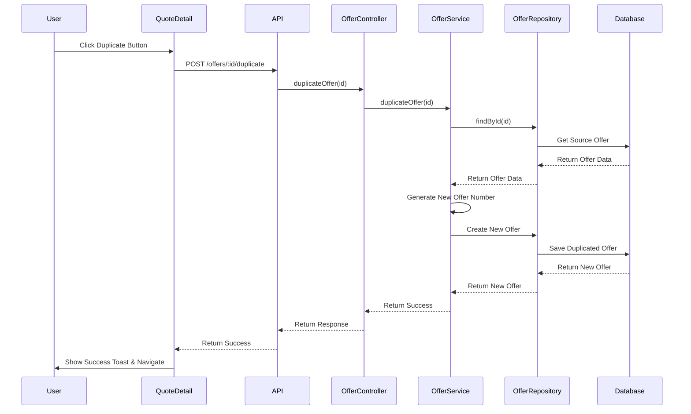

# Offer Duplication Functionality Plan

## Overview

This document outlines the plan to implement offer duplication functionality, allowing users to create a copy of an existing offer with a new offer number while preserving all offer data.

## Current System Analysis

### Offer Creation Flow

```
NewQuote Page → POST /offers → Offer Created → Email Sent to Customer
```

**Offer Data Structure:**

- `offerNumber`: Unique identifier (e.g., "OFF-2026-8196")
- `customerId`: Reference to customer
- `customerName`, `contactPerson`, `email`, `phone`, `address`: Customer details
- `items`: Array of products with pricing, quantity, discount, marking cost
- `offerDetails`: Valid until, valid days, show total price, additional terms
- `totalAmount`: Calculated total of all items
- `itemCount`: Number of items
- `status`: draft | sent | accepted | rejected | expired | completed
- `customerResponse`: pending | accepted | rejected
- `customerComments`: Array of comment objects
- `version`: Version number for tracking changes
- `respondedAt`: Date when customer responded

### Order Creation Flow

```
OrderCreate Page → POST /orders → Order Created → Printing Sheets Linked → Offer Status Updated to "completed"
```

**Order Data Structure:**

- `orderNumber`: Unique identifier (e.g., "SO-2026-001")
- `offerId`: Reference to original offer
- `customerId`: Reference to customer
- `items`: Array of products with selected color, size, printing method
- `totalAmount`: Calculated total
- `totalMargin`: Calculated margin using actual product margins
- `salesperson`: Salesperson name
- `status`: pending | processing | completed | cancelled

### Offer-Order Relationship

- **One-to-Many**: One offer can have multiple orders (currently only one order per offer)
- **Link**: Order has `offerId` field referencing the original offer
- **Status Update**: When order is created, offer status is updated to "completed"

## Current Duplicate Functionality (Frontend Only)

### QuoteDetail Page

- Has "Duplicate" button that navigates to: `/quotes/new?customer=${quote.customer.id}&duplicate=${quote.id}`
- No backend API call - only navigates with URL parameters

### NewQuote Page

- Reads `duplicate` and `customer` URL parameters
- Fetches source offer by ID from mock data
- Copies items, marks as duplicate
- Allows editing before creating new offer

**Limitation:** No backend API endpoint exists for duplicating offers. The current functionality only works with frontend mock data.

## Implementation Plan

### Phase 1: Backend Implementation

#### 1.1 Add `duplicateOffer` Method to OfferService

**File:** `backend/src/services/offer.service.ts`

**Method Signature:**

```typescript
async duplicateOffer(offerId: string): Promise<OfferResponse>
```

**Logic:**

1. Fetch source offer by ID
2. Validate offer exists
3. Generate new unique offer number (format: "OFF-{YEAR}-{RANDOM}")
4. Create new offer with copied data:
   - Same customer, items, offer details
   - New offer number
   - Status: "draft"
   - Customer response: "pending"
   - Customer comments: [] (empty)
   - Version: 1 (fresh copy)
   - Reset respondedAt: undefined
5. Return duplicated offer data

**Error Handling:**

- Offer not found → 404 error
- Database error → 500 error

#### 1.2 Add `duplicateOffer` Endpoint to OfferController

**File:** `backend/src/controllers/offer.controller.ts`

**Endpoint:** `POST /offers/:id/duplicate`

**Logic:**

1. Call `OfferService.duplicateOffer(offerId)`
2. Return response with success/error
3. Optionally send email notification (configurable)

#### 1.3 Add `duplicateOffer` Method to Frontend API Service

**File:** `src/services/api.ts`

**Method Signature:**

```typescript
async duplicateOffer(offerId: string): Promise<
  | { success: true; data: Offer; message: string }
  | { success: false; message: string }
>
```

**Logic:**

1. Call `POST /offers/${offerId}/duplicate`
2. Handle success/error responses
3. Return typed response

### Phase 2: Frontend Implementation

#### 2.1 Update QuoteDetail Page `handleDuplicate` Function

**File:** `src/pages/QuoteDetail.tsx`

**Changes:**

1. Add loading state: `const [duplicating, setDuplicating] = useState(false);`
2. Update `handleDuplicate` function:
   ```typescript
   const handleDuplicate = async () => {
     if (!quote) return;

     setDuplicating(true);
     try {
       const result = await apiService.duplicateOffer(quote.id);
       if (result.success) {
         toast({
           title: "Success",
           description: "Offer duplicated successfully",
         });
         // Navigate to new offer detail page
         navigate(`/quotes/${result.data._id}`);
       } else {
         toast({
           variant: "destructive",
           title: "Error",
           description: result.message || "Failed to duplicate offer",
         });
       }
     } catch (error) {
       console.error("Error duplicating offer:", error);
       toast({
         variant: "destructive",
         title: "Error",
         description: "Failed to duplicate offer. Please try again.",
       });
     } finally {
       setDuplicating(false);
     }
   };
   ```
3. Update "Duplicate" button to show loading state:
   ```tsx
   <Button variant="outline" onClick={handleDuplicate} disabled={duplicating}>
     {duplicating ? (
       <Loader2 className="animate-spin mr-2" size={16} />
     ) : (
       <Copy size={16} className="mr-2" />
     )}
     {duplicating ? "Duplicating..." : t("common.duplicate")}
   </Button>
   ```

#### 2.2 Update NewQuote Page (Optional Enhancement)

**File:** `src/pages/NewQuote.tsx`

**Current Behavior:** Already handles `duplicate` parameter correctly by fetching source offer and copying items.

**No Changes Required:** The existing logic is sufficient for the new offer creation flow.

### Phase 3: Testing

#### 3.1 Backend Testing

1. Create a test offer
2. Call `POST /offers/:id/duplicate`
3. Verify:
   - New offer created with unique offer number
   - All data copied correctly
   - Status set to "draft"
   - Customer response reset to "pending"
   - Customer comments cleared
   - Version set to 1

#### 3.2 Frontend Testing

1. Navigate to QuoteDetail page
2. Click "Duplicate" button
3. Verify:
   - Loading state shows
   - Success toast appears
   - Navigation to new offer detail page
   - New offer displays correctly
   - All data preserved

#### 3.3 Integration Testing

1. Duplicate an offer
2. Create order from duplicated offer
3. Verify:
   - Order created successfully
   - Offer status updated to "completed"
   - No conflicts between original and duplicated offer

## Data Flow Diagram



## Offer Number Generation Strategy

### Current Pattern

- Offers: `OFF-{YEAR}-{RANDOM}` (e.g., "OFF-2026-8196")
- Orders: `SO-{YEAR}-{SEQUENCE}` (e.g., "SO-2026-001")

### Duplication Strategy

- Generate new random number for duplicated offer
- Ensure uniqueness by checking database before saving
- Format: `OFF-{YEAR}-{4-digit random}`

## Edge Cases & Validation

### 1. Offer Not Found

- **Error:** 404 Not Found
- **Frontend:** Show error toast, stay on current page

### 2. Duplicate in Progress

- **Error:** 400 Bad Request
- **Frontend:** Disable button, show loading state

### 3. Database Error

- **Error:** 500 Internal Server Error
- **Frontend:** Show error toast, stay on current page

### 4. Version Conflicts

- **Scenario:** User edits source offer while duplicating
- **Handling:** Use latest version from database, ignore frontend changes

## Files to Modify

### Backend

1. `backend/src/services/offer.service.ts` - Add `duplicateOffer` method
2. `backend/src/controllers/offer.controller.ts` - Add `duplicateOffer` endpoint
3. `backend/src/repositories/offer.repository.ts` - Add `findByOfferNumber` method (if needed)

### Frontend

1. `src/services/api.ts` - Add `duplicateOffer` method
2. `src/pages/QuoteDetail.tsx` - Update `handleDuplicate` function

## Success Criteria

1. ✅ Backend API endpoint created and tested
2. ✅ Frontend calls backend API instead of mock data
3. ✅ Loading states displayed during duplication
4. ✅ Success/error toasts shown to user
5. ✅ Navigation to new offer after successful duplication
6. ✅ All offer data preserved in duplicated offer
7. ✅ New offer number generated and is unique
8. ✅ Status reset to "draft" for duplicated offer
9. ✅ Customer comments cleared in duplicated offer
10. ✅ Integration testing completed

## Future Enhancements

1. **Bulk Duplication:** Allow duplicating multiple offers at once
2. **Partial Duplication:** Allow selecting specific items to duplicate
3. **Template Duplication:** Create offer templates for common scenarios
4. **Version History:** Track all versions of an offer
5. **Comparison View:** Side-by-side comparison of original vs duplicated offer
